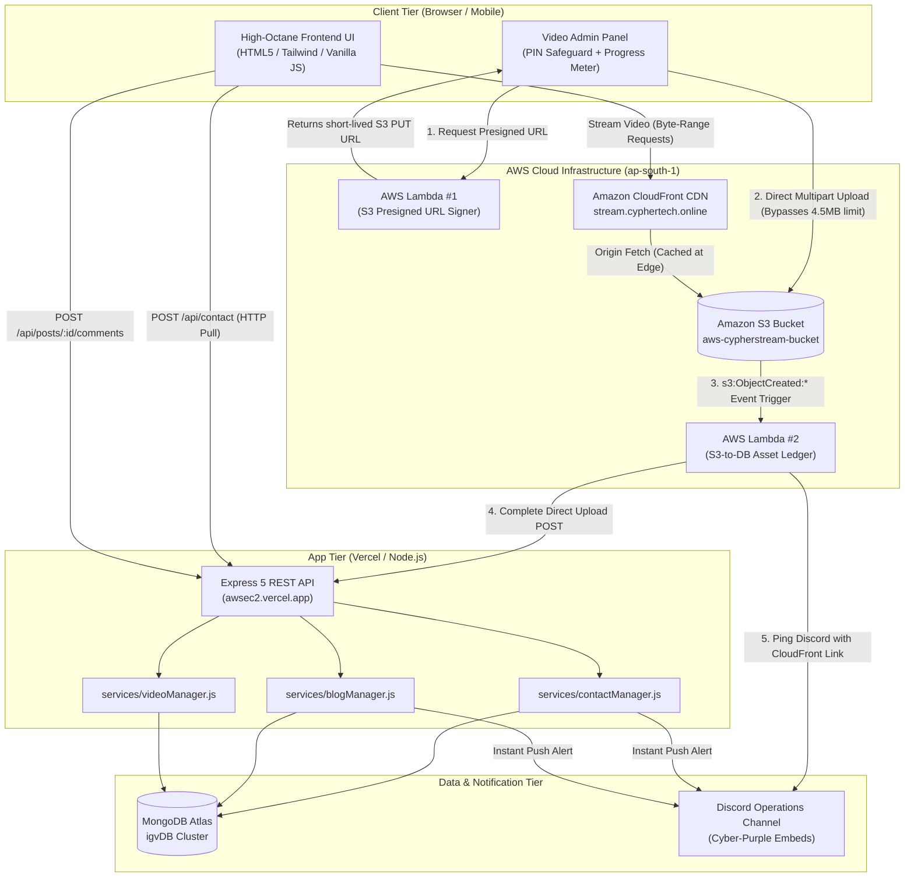

# ⚡ CypherTech Stream Hub (IGVictory)

> **Serverless, high-octane tactical gaming video streaming, live telemetry, and community intel hub.**

[](https://awsec2.vercel.app)
[](https://aws.amazon.com)
[](https://mongodb.com)
[](https://nodejs.org)
[](https://discord.gg/zZmAqnZ3T)

---

## 🌐 Live Production Links

- **Production App**: [stream.cyphertech.online](https://stream.cyphertech.online)
- **Vercel Mirror**: [awsec2.vercel.app](https://awsec2.vercel.app)
- **YouTube Hub**: [@CypherTechLive](https://www.youtube.com/@CypherTechLive)
- **Official X / Twitter**: [@CypherHarley](https://x.com/CypherHarley)
- **Discord Community**: [Join Channel](https://discord.gg/zZmAqnZ3T)
- **Operations Contact**: [satyamhimesh@gmail.com](mailto:satyamhimesh@gmail.com)

---

## 🛰️ The Architecture Evolution Story

### 1. The "Why": Moving from Dedicated EC2 to Serverless
The initial prototype ran as a stateful Express application inside a continuous **AWS EC2 (Elastic Compute Cloud)** virtual machine. While functional, this traditional architecture presented major bottlenecks:
- **Idle Cost Burn**: The EC2 instance incurred billing 24/7 regardless of traffic volume.
- **Maintenance Overhead**: OS updates, manual SSL renewal, process restarts, and container daemon supervision created operational drag.
- **The 4.5MB Serverless Payload Barrier**: Moving video ingestion to serverless edge platforms like Vercel hit an immediate wall—standard serverless functions enforce a strict **4.5MB request body payload limit**. Uploading high-bitrate 1080p/4K gaming broadcasts (50MB–2GB) through traditional server endpoints caused instant HTTP 413 Payload Too Large errors.
- **The Solution**: Transition to an **Event-Driven Serverless Ingest & Streaming Pipeline**. The browser requests a short-lived presigned upload URL from AWS Lambda, streams raw video directly into **Amazon S3**, and allows an event-driven Lambda to catalog metadata into **MongoDB Atlas** while **Amazon CloudFront** streams it globally at the edge.

### 2. Why WebSockets Were Abandoned in Favor of "HTTP Pull"
Early plans considered WebSockets (`ws://`) for live contact signals and blog comment updates. However, in serverless environments, WebSockets introduce unnecessary instability:
- **Serverless Timeouts**: Standard AWS Lambda and Vercel functions cannot hold persistent TCP connections open indefinitely—they terminate after their execution limits.
- **State Complexity**: A WebSocket setup would require heavy pub/sub infrastructure (AWS API Gateway WebSocket API + DynamoDB connection tables) just to handle notifications when no admin is online.
- **The HTTP Pull + Discord Webhook Architecture**:
  1. The client sends a fast, lightweight HTTP POST request (<100ms).
  2. Data is written to MongoDB Atlas in dedicated collections (`contact_messages` / `blog_comments`).
  3. The backend executes an unawaited, timeout-guarded HTTP POST directly to a private **Discord Operations Channel** via an Incoming Webhook.
  4. Readers and admins pull the latest 10 messages on demand with standard HTTP GET queries—giving zero idle cost, zero connection leaks, and immediate push notifications to mobile.

---

## 📐 System Architecture Diagram



---

## 🔩 Microservices & Serverless Breakdown

### 1. AWS Lambda #1: Secure Pre-Signed URL Signer
- **Runtime**: Node.js 20.x on AWS Lambda.
- **Responsibility**: Uses `@aws-sdk/s3-request-presigner` and `PutObjectCommand` to generate cryptographically signed URLs valid for 15 minutes.
- **Advantage**: The client streams raw video bytes directly into S3, offloading all upload bandwidth and memory pressure from the web server.

### 2. AWS Lambda #2: S3-to-DB Asset Ledger (`s3todb`)
- **Trigger**: Automatic `s3:ObjectCreated:*` event filter on `igv_videos/` prefix.
- **Responsibility**:
  - Decodes URL-encoded object keys and strips timestamp prefixes into clean presentation titles.
  - Automatically filters out internal thumbnails and metadata artifacts.
  - Constructs the production CloudFront edge URL (`https://stream.cyphertech.online/{fileKey}`).
  - Fires an authenticated HTTP POST to `/api/admin/videos/complete-direct-upload` to persist the record in MongoDB.
  - Posts a styled Discord embed notification with a direct `[Watch Stream ↗]` link.

### 3. Media Delivery Pipeline: Amazon CloudFront CDN
- **Domain**: `stream.cyphertech.online`
- **Origin**: S3 bucket `aws-cypherstream-bucket` with Origin Access Control (OAC).
- **Playback Mechanics**:
  - Full support for RFC 7233 byte-range requests for instantaneous video scrubbing and zero buffering.
  - Automatic differentiation: `.mp4` video plays in the tactical video player, while `.mp3` tracks render in dedicated interactive audio visualizer cards.

---

## 🎨 Core Features & UI Highlights

### ⚡ Tactical Valorant / Leonida Dark Cyber Aesthetic
- **Color Palette**: Void Ink (`#0F1923`), Vice Pink (`#FF4655`), Cyber Cyan (`#00F0FF`), and Neon Coral (`#FE2C55`).
- **Typography & HUD**: Custom angular cutouts (`clip-path: polygon(...)`), scanline grid overlays, and monospaced telemetry readouts.
- **Zero Heavy Frameworks**: Ultra-fast initial load times using semantic HTML5, Vanilla JavaScript, and Tailwind CSS.

### 🎬 Adaptive Media Vault & Player (`/media`)
- **Multi-Source Streaming**: Seamless switching between S3 CloudFront MP4 streams, YouTube embeds, and Twitch live broadcasts.
- **Theater Popup Mode (`<->`)**: Clicking the expand toggle pops out any playing stream or highlight into an expansive max-7xl cinema modal without resetting playback position.
- **Smart File Detection**: Automatically routes `.mp4` files to video viewports and `.mp3` files to specialized song player cards.

### 💬 Blog & Field Transmissions (`/blog`)
- **MongoDB HTTP Pull Engine**: Reader discussions pull the latest 10 messages dynamically from MongoDB (`blog_comments` collection) with humanized relative timestamps (`just now`, `5m ago`, `2h ago`).
- **Normalized Typography**: Clean markdown reader decoupling subheadings (`###`) from paragraph blocks to prevent all-caps wall-of-text formatting.
- **Instant Discord Dispatch**: Every reader submission triggers a Vice-Pink embed alert in Discord.

### 📡 Operational Signal Terminal (`/contact`)
- **Live Transmission Dispatch**: Form submissions commit to MongoDB collection `contact_messages` and fire a zero-delay Cyber-Purple notification to Discord in <100ms.
- **Live Inbox Pull**: Dynamic client-side pull showing the latest transmissions without keeping socket channels active.

### 🔐 Video Admin Command Center (`/videoadmin`)
- **Local Safeguard PIN**: Protected with a 1-hour session security token—eliminating repeated PIN prompts on page refresh.
- **Client-Side S3 Uploader**: Real-time progress bar with uploaded percentage, elapsed time, and byte counters.
- **Placement Manager**: Assigns videos to `home_gameplay`, `home_hero`, or `media_page` dynamically.
- **Integrated Blog Publisher**: Write and publish rich blogs directly to MongoDB with automatic S3 image uploads.

---

## 🔑 Environment Variables Blueprint

Create a `.env` file in the root directory modeled after `.env.example`:

```env
# Server Port
PORT=8080

# MongoDB Atlas Connection URI
MONGO_URI=mongodb+srv://<username>:<password>@<cluster>.mongodb.net/igvDB?retryWrites=true&w=majority

# Video Admin Safeguard Password
VIDEO_ADMIN_PASSWORD=your_secure_password
ADMIN_PASSWORD=your_secure_password

# Discord Operations Webhook
DISCORD_WEBHOOK_URL=https://discord.com/api/webhooks/<webhook_id>/<webhook_token>

# AWS S3 Storage Credentials (ap-south-1)
AWS_ACCESS_KEY_ID=AKIAxxxxxxxxxxxxxxxx
AWS_SECRET_ACCESS_KEY=xxxxxxxxxxxxxxxxxxxxxxxxxxxxxxxxxxxxxxxx
AWS_REGION=ap-south-1
AWS_S3_BUCKET=aws-cypherstream-bucket

# Amazon CloudFront CDN Domain
CLOUDFRONT_DOMAIN=stream.cyphertech.online

# Twitch API Integration
TWITCH_CLIENT_ID=your_twitch_client_id
TWITCH_CLIENT_SECRET=your_twitch_client_secret
```

---

## 🚀 Getting Started & Local Development

### Prerequisites
- [Node.js](https://nodejs.org/) (v20.0.0 or higher recommended)
- [npm](https://www.npmjs.com/) (v9.0.0 or higher)
- A [MongoDB Atlas](https://www.mongodb.com/cloud/atlas) cluster connection string

### 1. Clone the Repository
```bash
git clone https://github.com/himesh220002/awsec2.git
cd testawsec2
```

### 2. Install Dependencies
```bash
npm install
```

### 3. Configure Local Environment
```bash
cp .env.example .env
# Edit .env with your MongoDB Atlas and AWS credentials
```

### 4. Start the Application Server
```bash
# Starts the Express application on port 8080
npm start
```
The server will boot and announce:
```
◇ injected env from .env
Server running on http://localhost:8080
[TournamentManager] Connected to MongoDB Atlas cluster
[MediaManager] Connected to MongoDB Atlas cluster (igvDB.videos)
```

### 5. Access Local Endpoints
- **Home**: [http://localhost:8080/](http://localhost:8080/)
- **Media Vault**: [http://localhost:8080/media](http://localhost:8080/media)
- **Blog & Transmissions**: [http://localhost:8080/blog](http://localhost:8080/blog)
- **Contact Terminal**: [http://localhost:8080/contact](http://localhost:8080/contact)
- **Video Admin**: [http://localhost:8080/videoadmin](http://localhost:8080/videoadmin)

---

## 🛡️ Core API Route Specification

| Method | Endpoint | Description |
| :--- | :--- | :--- |
| **GET** | `/api/videos` | Fetch all indexed S3 and YouTube video records |
| **POST** | `/api/videos/upload-url` | Generate presigned S3 upload URL for direct client ingest |
| **POST** | `/api/admin/videos/complete-direct-upload` | Register direct S3 upload with MongoDB and CloudFront |
| **DELETE** | `/api/videos/:id` | Remove video record from MongoDB and delete S3 object |
| **GET** | `/api/posts` | Fetch all gaming intel blog dispatches |
| **GET** | `/api/posts/:id/comments` | **HTTP Pull**: Fetch the 10 most recent field comments |
| **POST** | `/api/posts/:id/comments` | Post a comment, save to MongoDB, and alert Discord |
| **POST** | `/api/contact` | Submit contact transmission, save to DB, and ping Discord |
| **GET** | `/api/contact` | **HTTP Pull**: Retrieve recent contact messages |
| **GET** | `/api/twitch/hub` | Get aggregated live Twitch streams with cached metadata |

---

## 🔒 Security & Best Practices

1. **Zero Secret Leaks**: The `.env` file is strictly ignored by Git. Never commit Discord Webhooks, AWS keys, or MongoDB URIs to public repositories.
2. **Short-Lived Presigned URLs**: S3 presigned PUT URLs expire automatically after 15 minutes, preventing replay attacks.
3. **Serverless Suspension Safeguards**: All Discord webhook notifications utilize timeout-guarded async fetch operations, ensuring requests flush before serverless containers enter execution freeze.
4. **Origin Access Control**: S3 bucket policies restrict direct public access, ensuring video traffic passes through CloudFront edge caching.

---

## 👨‍💻 Project Owner & Inquiries

- **Author**: Himesh / CypherTech
- **Email**: [satyamhimesh@gmail.com](mailto:satyamhimesh@gmail.com)
- **GitHub**: [@himesh220002](https://github.com/himesh220002)
- **License**: ISC
